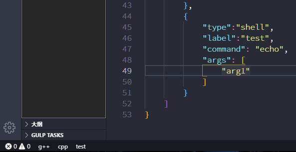
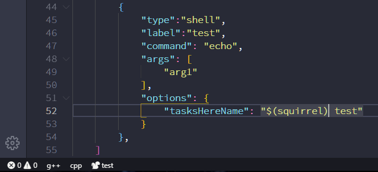

# Tasks Here

Load VSCode Tasks to Status Bar

This extension evolved from *extension:actboy168.tasks*

## Preview



## Settings

We do some general configuration through the **settings.json**, as most extensions do.And also, for ease of configuration,we do some special configuration through the **tasks.json** for each task.If the configuration is done in the tasks.json, I will identify it above the code or image

This extension will show all vscode-tasks on the status bar.If you want to hide a task, add an configuration like this:

[*tasks.json*]

```json
        {
            "type":"shell",
            "label":"test",
            "command": "echo",
            "args": [
                "arg1"
            ],
            "options": {
                "tasksHereDisplay": "hide"
            }
        }
```

This extension uses the label of the task as the display name on the status bar. How ever, if the task name is too long to fit for display and you don't want to change it, you can customize the task name by add an configuration like this:

[*tasks.json*]

```json
        {
            "type":"shell",
            "label":"g++.exe build active file",
            "command": "g++",
            "args": [
                "-g",
                "${file}",
                "-o",
                "${fileDirname}\\${fileBasenameNoExtension}.exe"
            ],
            "options": {
                "tasksHereName": "g++"
            }
        }
```

You can "add" a built-in icon to the task name with a special syntax, which will appear as an icon on the status bar

[*tasks.json*]

```json
        {
            "type":"shell",
            "label":"test",
            "command": "echo",
            "args": [
                "arg1"
            ],
            "options": {
                "tasksHereName": "$(squirrel) test"
            }
        }
```



You can find a list of built-in icons provided by VSCode on this page: [icons-in-labels](https://code.visualstudio.com/api/references/icons-in-labels)

Specify the color of the task name.You can use legal color expressions supported by CSS. For example: "DeepPink", "#00f", "#adff2f". If you are not sure, you can use the search engine to search for the keyword "CSS color".Note that the color of the icon will change as well.

[*tasks.json*]

```json
       {
            "type": "shell",
            "label": "cpp.exe build active file",
            "command": "C:\\MinGW64\\x86_64-8.1.0-release-win32-seh-rt_v6-rev0\\mingw64\\bin\\cpp.exe",
            "args": [
                "-g",
                "${file}",
                "-o",
                "${fileDirname}\\${fileBasenameNoExtension}.exe"
            ],
            "options": {
                "cwd": "C:\\MinGW64\\x86_64-8.1.0-release-win32-seh-rt_v6-rev0\\mingw64\\bin",
                "tasksHereName": "cpp",
                "tasksHereColor": "DeepPink"
            }
        }
```


