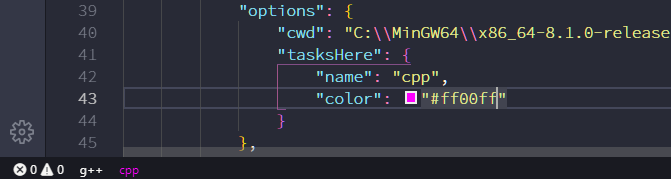

# Tasks Here

[](https://marketplace.visualstudio.com/items?itemName=alexzshl.tasks-here)

Load VSCode tasks into status bar.

Notice: version 3.0.0 starts to use a new configuration form in **tasks.json**, the previous users please try to migrate.

## Derived

Derived from VSCode extension - [actboy168.tasks v0.2.7](https://marketplace.visualstudio.com/items?itemName=actboy168.tasks).

## Preview


## Features

- Load VSCode tasks into status bar
- Customize the name of the task-bar
- Customize the name with VSCode builtin icons
- Customize the color of the task-bar

## Configuration - tasks.json

For ease of configuration,this extension personalize tasks with **tasks.json**.

If you want to hide a task, add a configuration in tasks.json:

[*options-tasksHere-display*]

```json
        {
            "type":"shell",
            "label":"test",
            "command": "echo",
            "args": [
                "arg1"
            ],
            "options": {
                "tasksHere": {
                    "display": false
                }
            }
        }
```

If the task label is too long to fit for display and you don't want to modify it, you can customize a name for task-bar by add a configuration in tasks.json:

[*options-tasksHere-name*]

```json
        {
            "type":"shell",
            "label":"g++.exe build active file",
            "command": "g++",
            "args": [
                "-g",
                "${file}",
                "-o",
                "${fileDirname}\\${fileBasenameNoExtension}.exe"
            ],
            "options": {
                "tasksHere": {
                    "name": "g++"
                }
            }
        }
```

You can add built-in icons to the status bar item:

[*options-tasksHere-name*]

```json
        {
            "type":"shell",
            "label":"test",
            "command": "echo",
            "args": [
                "arg1"
            ],
            "options": {
                "tasksHere": {
                    "name": "$(squirrel) test"
                }
            }
        }
```


The list of built-in icons can be getting from this page: [icons-in-labels](https://code.visualstudio.com/api/references/icons-in-labels).

You can specify the color also. For example: "DeepPink", "#00f", "#adff2f".Or use the color picker to select a color directly. The color of the icon will change as well.

[*options-tasksHere-color*]

```json
       {
            "type": "shell",
            "label": "cpp.exe build active file",
            "command":"C:\\MinGW64\\x86_64-8.1.0-release-win32-seh-rt_v6-rev0\\mingw64\\bin\\cpp.exe",
            "args": [
                "-g",
                "${file}",
                "-o",
                "${fileDirname}\\${fileBasenameNoExtension}.exe"
            ],
            "options": {
                "cwd": "C:\\MinGW64\\x86_64-8.1.0-release-win32-seh-rt_v6-rev0\\mingw64\\bin",
                "tasksHere": {
                    "name": "cpp",
                    "color": "#ff00ff"
                }
            }
        }
```




## Settings

Configuration with VSCode settings:

- `taskshere.on` - Enable/Disable the extension
- `taskshere.display` - If you have too many tasks, you can set it to **false**, then display the tasks you want to display by configuring **tasks.json**
- `taskshere.color` - Global color for task-bar

## Commands

We provide this commands. How ever, you don't need to use them usually.

- `taskshere.refresh` - reload tasks into status bar
- `taskshere.on`
- `taskshere.off`
